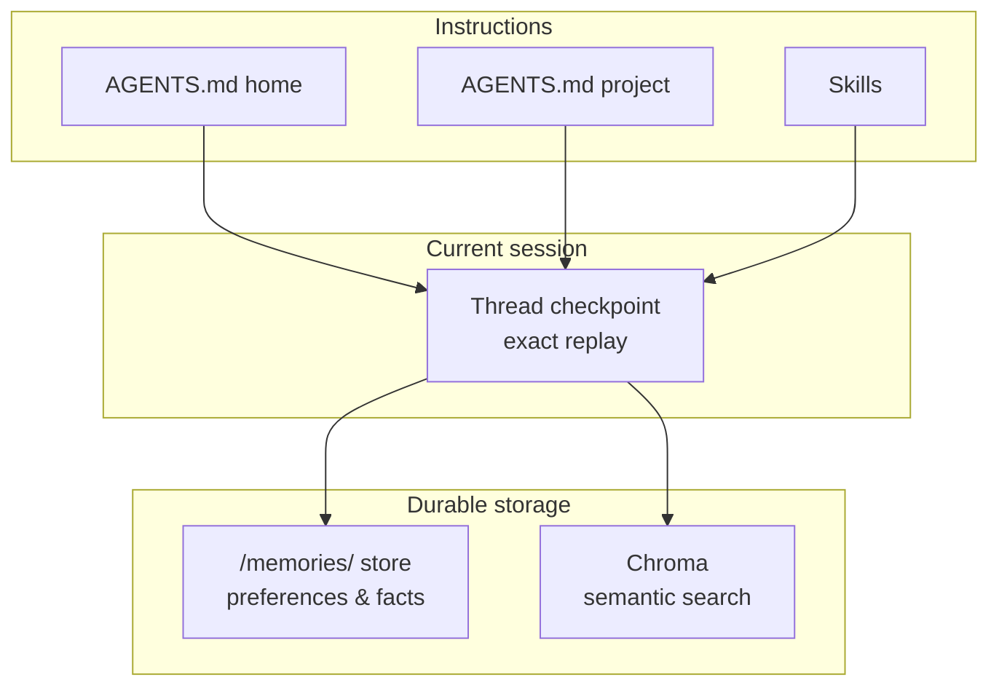

# my-agent

**Your personal macOS coding agent — local, persistent, and built to work the way you do.**

my-agent is a terminal-native deep agent powered by [LangChain Deep Agents](https://github.com/langchain-ai/deepagents) and [OpenRouter](https://openrouter.ai/). It runs shell commands, reads and writes files, searches the web, remembers conversations across sessions, and connects to [MCP](https://modelcontextprotocol.io) servers for pluggable tools — all from a fast, streaming REPL.

Run it from any project directory. Your personal defaults travel with you; project-specific rules and skills load automatically when you're in a repo.

---

## At a glance

| Capability | What it means for you |
|------------|----------------------|
| **Interactive chat** | Streaming REPL with resumable threads and rich tool visibility |
| **One-shot tasks** | `my-agent run "…"` for scripts, automation, and quick prompts |
| **Persistent memory** | SQLite checkpoints, durable `/memories/` notes, and semantic search across past chats |
| **Voice input** | Push-to-talk in chat (`/mic`) or transcribe audio files via OpenRouter STT |
| **MCP integration** | Plug in local and remote MCP servers (stdio, HTTP, SSE, WebSocket) |
| **Agent skills** | Markdown workflows the agent loads on demand — project or user scoped |
| **Subagent delegation** | Spawn isolated subagents for complex tasks with live streaming progress |
| **Human-in-the-loop** | Optional approval before shell commands and file writes (on by default) |
| **Portable by design** | Global defaults in `~/.my-agent/` + per-project overrides in `./` |

---

## Features

- **Interactive chat** — REPL-style terminal chat with streaming output, thread resume, and Ctrl+C redirect
- **One-shot tasks** — run a single prompt and exit; optional `--audio` for voice-driven tasks
- **Persistent threads** — chat history survives restarts via SQLite checkpoints
- **Context summarization** — automatically compresses long conversations to stay within context limits
- **Semantic memory** — ChromaDB indexes conversations for cross-thread search
- **Durable notes** — agent-written files under `/memories/` persist preferences, contacts, and facts
- **Agent skills** — repeatable markdown workflows in `skills/` and `~/.my-agent/skills/`
- **MCP server integration** — connect local and remote MCP servers for tools and resources
- **Subagent delegation** — spawn isolated subagents for complex multi-step work
- **Web search & fetch** — Tavily integration and page fetching for live information (optional)
- **Voice input** — push-to-talk in chat or standalone transcription via OpenRouter
- **Human-in-the-loop** — optional approval before destructive shell and file actions
- **Verbose mode** — show reasoning, tool calls, tool results, and loaded skills

---

## Requirements

- macOS (designed for local shell and filesystem access)
- Python 3.11+
- [uv](https://docs.astral.sh/uv/) or pip
- [OpenRouter](https://openrouter.ai/) API key
- Tavily API key (optional, for web search)
- Voice extras (optional): `pip install -r requirements-voice.txt` or `pip install 'my-agent[voice]'` for push-to-talk capture

---

## Quick start

```bash
git clone git@github.com:vikasudasi/my-agent.git
cd my-agent

# Create virtual environment and install
uv venv
uv pip install -r requirements-voice.txt   # includes push-to-talk (/mic) deps
# Or: uv pip install -e .                    # base only (no /mic)
# Or: uv pip install -e '.[voice]'           # same as requirements-voice.txt

# Configure
cp config.toml.example config.toml
cp .env.example .env
# Edit .env with your OPENROUTER_API_KEY (and TAVILY_API_KEY if desired)

# Start chatting
my-agent chat
```

**Try it:**

```bash
my-agent chat --continue          # pick up your last conversation
my-agent chat --voice             # enable /mic push-to-talk
my-agent run "Summarize this repo"  # one-shot task
my-agent transcribe recording.wav   # speech-to-text only
```

---

## Global installation

Install once, use from anywhere:

```bash
# After uv pip install -e ., the my-agent entrypoint is on your PATH
echo 'export PATH="$HOME/my-agent/.venv/bin:$PATH"' >> ~/.zshrc
```

Once installed, `my-agent` resolves files in this order:

| Resource | Resolution | Detail |
|----------|------------|--------|
| **`config.toml`** | `--config` CLI → `./config.toml` → `~/.my-agent/config.toml` | First-found wins |
| **`.env`** | `~/.my-agent/.env` then `./.env` | Cwd values override home |
| **`AGENTS.md`** | `~/.my-agent/AGENTS.md` **and** `./AGENTS.md` | Both injected into system prompt |
| **User skills** | `~/.my-agent/skills/{name}/SKILL.md` | Always available |
| **Project skills** | `./skills/{name}/SKILL.md` | Loaded when the directory exists |
| **Checkpoints** | `~/.my-agent/checkpoints.sqlite` | Thread persistence |
| **`/memories/` store** | `~/.my-agent/store.sqlite` | Durable agent-written notes |
| **Chroma DB** | `~/.my-agent/chroma/` | Semantic conversation index |

Run `my-agent chat` from any project directory — it picks up local `config.toml`, `AGENTS.md`, and `skills/` while sharing the same global checkpoints, memories, and user skills.

---

## Configuration

Copy `config.toml.example` to either location:

```bash
# Personal defaults (used from any directory)
cp config.toml.example ~/.my-agent/config.toml

# Project-specific (overrides personal defaults when in this directory)
cp config.toml.example /path/to/project/config.toml
```

Secrets go in `.env` — loaded from `~/.my-agent/.env`, then overridden by `./.env`:

| Variable | Required | Description |
|----------|----------|-------------|
| `OPENROUTER_API_KEY` | Yes | API key for the LLM and speech-to-text via OpenRouter |
| `TAVILY_API_KEY` | No | Enables live web search |

### Config sections

| Section | Purpose |
|---------|---------|
| `[llm]` | Model slug (e.g. `anthropic/claude-sonnet-4-6`) and temperature |
| `[agent]` | Home directory root (`~`) and optional system prompt override |
| `[security]` | `require_approval` — prompt before destructive shell/file actions |
| `[paths]` | Agent state directory, skills paths, and Chroma location |
| `[checkpoint]` | Thread persistence (`sqlite` or `memory`), retention limits |
| `[store]` | `/memories/` persistence (`sqlite` or `memory`) |
| `[memory]` | Chroma collection and embedding model |
| `[tavily]` | Web search defaults |
| `[voice]` | Speech-to-text model, language hint, and capture settings |
| `[summarization]` | Auto-summarize long conversations to manage context window |
| `[display]` | Streaming verbosity defaults |
| `[mcp]` | MCP server integration (see [MCP Configuration](#mcp-configuration)) |

Persistent data lives under `~/.my-agent/` by default.

### Context summarization

Long conversations are automatically summarized when non-system messages exceed `max_messages`. Older turns are replaced with a concise summary, keeping the most recent `keep_last` messages intact:

```toml
[summarization]
enabled = true
max_messages = 30
keep_last = 10
# model = ""   # optional cheaper model; defaults to [llm].model
```

Set `enabled = false` to disable.

---

## Voice input

Speech-to-text runs through OpenRouter's transcription API (same `OPENROUTER_API_KEY`).

**Interactive chat** — enable with `--voice` or `[voice].enabled = true`:

```bash
my-agent chat --voice
# In the REPL: /mic → hold Space to record → release to transcribe
# Then: Enter = send, e = edit, r = re-record, c = cancel
```

**One-shot with audio** — transcribe a file and run it as a task:

```bash
my-agent run --audio question.wav
my-agent run "Also check the logs" --audio followup.wav
```

**Transcribe only** — no agent invocation:

```bash
my-agent transcribe recording.wav
```

Supported formats: wav, mp3, flac, m4a, ogg, webm, aac.

```toml
[voice]
enabled = false
model = "openai/whisper-large-v3"
language = ""              # ISO-639-1 hint, e.g. "en"; empty = auto-detect
max_duration_seconds = 120
confirm_before_send = true
```

---

## MCP configuration

my-agent supports the [Model Context Protocol](https://modelcontextprotocol.io) for connecting external tools and resources. Configure servers in `config.toml` under `[mcp]`.

### Quick start

```toml
[mcp]

# Stdio (local subprocess)
[[mcp.servers]]
name = "filesystem"
transport = "stdio"
command = "npx"
args = ["-y", "@modelcontextprotocol/server-filesystem", "/tmp"]

# Streamable HTTP (remote)
[[mcp.servers]]
name = "weather"
transport = "http"
url = "http://localhost:8000/mcp"
headers = { Authorization = "Bearer ${MCP_WEATHER_TOKEN}" }

# SSE (remote)
[[mcp.servers]]
name = "sse-server"
transport = "sse"
url = "http://localhost:8000/mcp/sse"

# WebSocket (remote)
[[mcp.servers]]
name = "ws-server"
transport = "websocket"
url = "ws://localhost:8000/mcp"
```

### Transport reference

| Transport | `transport` value | Use case |
|-----------|-------------------|----------|
| **Stdio** | `"stdio"` | Local subprocess (e.g. `npx`-based MCP servers) |
| **Streamable HTTP** | `"http"`, `"streamable_http"`, `"streamable-http"` | Remote server using Streamable HTTP |
| **SSE** | `"sse"` | Remote server using Server-Sent Events |
| **WebSocket** | `"websocket"` | Remote server using WebSocket |

### Per-server fields

| Field | Type | Required | Description |
|-------|------|----------|-------------|
| `name` | string | yes | Unique identifier |
| `transport` | string | yes | `stdio`, `sse`, `http`, `streamable_http`, or `websocket` |
| `command` | string | stdio only | Executable to run |
| `args` | string[] | optional | Command-line arguments |
| `url` | string | remote only | Server URL |
| `headers` | table | optional | HTTP headers (`${ENV_VAR}` interpolation supported) |

MCP servers from `~/.my-agent/config.toml` and `./config.toml` are **merged**; project-level definitions override home-level ones with the same `name`. Failed servers are skipped with a warning — the agent continues with whatever tools loaded successfully.

---

## CLI reference

```
my-agent
├── chat                         Interactive REPL
├── run <task>                   One-shot task
├── transcribe <audio>           Transcribe an audio file (OpenRouter STT)
├── help [topic]                 Command reference in the terminal
├── threads
│   ├── list          List saved chat threads
│   ├── prune         Delete old threads by retention limits
│   └── delete <id>   Delete one thread
└── memories
    ├── list          List /memories/ files
    └── read <path>   Print a /memories/ file
```

Global options (most commands):

| Option | Description |
|--------|-------------|
| `--config FILE` | Path to `config.toml` |
| `--help` | Typer help for a command |
| `my-agent help [topic]` | Full reference (e.g. `help chat`, `help threads prune`) |

### `my-agent chat`

Interactive REPL. Each session prints a `thread_id`. Type `exit` or `quit` to leave.

| Option | Description |
|--------|-------------|
| `--thread-id TEXT` | Resume a specific saved thread |
| `--continue` | Resume the most recently updated thread |
| `--voice` | Enable voice input (`/mic` for push-to-talk) |
| `--verbose` | Show reasoning, tool calls, tool results, and loaded skills |
| `--quiet` | Hide reasoning, tool calls, tool results, and loaded skills |

```bash
my-agent chat
my-agent chat --continue
my-agent chat --voice
my-agent chat --thread-id <uuid>
```

### `my-agent run`

Run a single task and exit.

| Option | Description |
|--------|-------------|
| `TASK` | One-shot prompt (optional with `--audio`) |
| `--thread-id TEXT` | Attach to an existing thread |
| `--continue` | Use the most recently updated thread |
| `--audio FILE` | Transcribe audio and use as the task |
| `--verbose` / `--quiet` | Display verbosity |

```bash
my-agent run "List the five largest files in my Downloads folder"
my-agent run --audio question.wav
my-agent run --continue "Now sort them by date"
```

### `my-agent transcribe`

Transcribe an audio file via OpenRouter speech-to-text (no agent invocation).

```bash
my-agent transcribe recording.wav
```

### `my-agent threads`

```bash
my-agent threads list [--limit N]
my-agent threads prune [--dry-run] [--keep N] [--max-age-days N]
my-agent threads delete <thread-id> [--yes]
```

### `my-agent memories`

```bash
my-agent memories list [--limit N]
my-agent memories read /memories/user.md
```

### Common workflows

```bash
# Start fresh — note the thread_id printed at startup
my-agent chat

# Pick up where you left off
my-agent chat --continue

# Find and resume an older thread
my-agent threads list
my-agent chat --thread-id <uuid>

# Inspect what the agent remembers
my-agent memories list
my-agent memories read /memories/user.md

# Reclaim checkpoint disk space
my-agent threads prune --dry-run
my-agent threads prune

# Use project-specific config and skills
cd ~/projects/my-app
my-agent chat
```

---

## Memory

The agent uses layered memory — each layer serves a different purpose:



| Layer | Storage | Purpose |
|-------|---------|---------|
| **Thread checkpoint** | `~/.my-agent/checkpoints.sqlite` | Exact replay of the current chat (`thread_id`) |
| **`/memories/` store** | `~/.my-agent/store.sqlite` | Durable agent-written notes |
| **Chroma** | `~/.my-agent/chroma` | Semantic search across past conversations |
| **AGENTS.md (home)** | `~/.my-agent/AGENTS.md` | Personal operating principles |
| **AGENTS.md (project)** | `./AGENTS.md` | Project-specific rules |
| **Skills** | `skills/` and `~/.my-agent/skills/` | Repeatable workflows loaded when relevant |

Within a thread, prior turns are remembered automatically. Personal facts belong in `/memories/`. Across threads, the agent can call `search_past_conversations` and related tools to find older context.

---

## Skills

Skills are markdown files with YAML frontmatter that teach the agent repeatable workflows.

| Scope | Filesystem path | Virtual path |
|-------|-----------------|--------------|
| Project | `./skills/{name}/SKILL.md` | `/skills/project/{name}/` |
| User | `~/.my-agent/skills/{name}/SKILL.md` | `/skills/{name}/` |

Bundled project skills:

| Skill | Purpose |
|-------|---------|
| `tavily-web-search` | When and how to search the live web |
| `webpage-fetch` | Fetching and reading web pages |
| `creating-skills` | How the agent authors new skills |
| `mcp-config` | MCP server configuration guidance |
| `task-management` | Structured task planning and tracking |
| `caveman` | Git workflow orchestration |
| `caveman-commit` | Commit message conventions |
| `caveman-review` | Code review workflow |
| `caveman-help` | Caveman skill reference |
| `semble-search` | Semble platform search |

See [AGENTS.md](AGENTS.md) for the agent's operating principles.

---

## Virtual paths

The agent uses a virtual filesystem. Paths starting with `/` route to different backends:

| Virtual path | Maps to | Description |
|--------------|---------|-------------|
| `/memories/` | `store.sqlite` | Durable agent-written notes |
| `/cwd/` | Current working directory | Read/write project files |
| `/skills/` | `~/.my-agent/skills/` | User-scoped skills |
| `/skills/project/` | `./skills/` | Project-scoped skills |
| `/.agent/` | Agent state (per thread) | Internal agent files |

Example: ask the agent to edit `/cwd/src/main.py` when running from a project directory.

---

## Project structure

```
my-agent/
├── AGENTS.md                  # Agent instructions (injected into system prompt)
├── config.toml.example        # Configuration template (includes MCP examples)
├── skills/                    # Project-scoped agent skills
├── src/my_agent/
│   ├── agent.py               # Deep agent setup, MCP tool injection
│   ├── checkpoint.py          # Thread persistence
│   ├── store.py               # /memories/ persistence
│   ├── cli.py                 # Typer CLI
│   ├── config.py              # Config loading
│   ├── display.py             # Streaming output
│   ├── runner.py              # Turn execution
│   ├── help_text.py           # CLI help text
│   ├── messages.py            # Message utilities
│   ├── terminal_input.py    # REPL input handling
│   ├── memory/                # Chroma conversation store
│   ├── middleware/            # Summarization and other middleware
│   ├── voice/                 # Speech-to-text capture and transcription
│   └── tools/
│       ├── mcp_tools.py       # MCP server tool loading
│       ├── delegate_task.py   # Subagent delegation
│       ├── fetch_page.py      # Web page fetch
│       ├── tavily_search.py   # Web search
│       └── conversation_memory.py
├── tests/
└── pyproject.toml
```

---

## Development

```bash
# Install with voice + test dependencies
uv pip install -r requirements-dev.txt
# Or: uv pip install -e '.[voice,test]'

# Run the test suite
pytest tests/

# Run with coverage
pytest tests/ --cov=my_agent
```

Optional dependency groups (also available as `requirements*.txt` wrappers):

| Extra | Install | Purpose |
|-------|---------|---------|
| (base) | `pip install -r requirements.txt` | Core agent |
| `voice` | `pip install -r requirements-voice.txt` | Push-to-talk audio capture in chat |
| `voice` + `test` | `pip install -r requirements-dev.txt` | Development and pytest |
| `voice` | `pip install 'my-agent[voice]'` | Same as `requirements-voice.txt` when published |
| `test` | `pip install 'my-agent[test]'` | pytest and coverage only |

---

## Security

- The agent can run shell commands and modify files within its configured root directory.
- With `require_approval = true` (default), destructive actions pause for your approval.
- Checkpoints and Chroma may contain tool output from your machine — stored locally in `~/.my-agent/`, never committed to git.
- Never commit `.env` or `config.toml` with real API keys.

---

## License

Personal project — no license specified.
